# URL-Based Music Box Cylinder Sharing: Architecture & Implementation Plan

## 1. Executive Summary & Design Principles

In the **Mechanical Music Box Sequencer & Studio**, musical arrangements and custom pinned cylinders can be shared instantly between users via **direct, self-contained URLs** without requiring any backend database, cloud storage, API servers, or user accounts.

### Core Architectural Principles
- **Zero-Backend & Serverless**: Music box cylinder songs are serialized, compacted, compressed, and encoded completely client-side. There are zero egress costs, zero database synchronization issues, and zero server maintenance.
- **Privacy-First**: Score arrangements, AI-composed melodies, and custom pin layouts travel directly between sender and recipient inside the URL link. No external telemetry or cloud database stores the user's creations.
- **Immunity to HTTP 414/431 (URI Too Long)**: Payloads are stored in the **URL Hash Fragment** (`#song=...` or `#preset=...`). Browsers never transmit hash fragments to web servers in HTTP request headers, ensuring that static hosting, Cloud Run proxies, and CDNs never reject shared links.
- **Extreme Payload Compaction**: Music box pins (`{ tineIndex, step }`) are converted to integer tuples `[tineIndex, step]` and stripped of redundant note name strings (which are automatically derived from the active Comb Scale). This reduces raw JSON payload size by **75%** before compression, allowing even complex 128-step multi-tine songs to compress down to **180–350 bytes** (easily fitting inside QR codes, SMS, and chat messengers).
- **Dual-Mode Sharing**: Built-in classical cylinders (Für Elise, Canon in D, Spirited Away, etc.) generate ultra-compact preset links (`#preset=fur-elise`, < 50 characters), while custom or modified scores generate compressed payloads (`#song=...`).

---

## 2. Architecture & Data Flow

```mermaid
flowchart TD
    subgraph Sharing / Encoding Pipeline
        A["Active MusicBoxSong (Pins, CombScale, BPM, Steps)"] --> B{"Is Unmodified Preset?"}
        B -- Yes --> C["Generate Ultra-Compact URL: #preset=<id>"]
        B -- No --> D["packMusicBoxSong(): Convert pins to [tineIndex, step] tuples, drop redundant note strings"]
        D --> E["Native CompressionStream('deflate-raw' | 'gzip')"]
        E --> F["uint8ArrayToBase64Url(): RFC 4648 §5 URL-Safe Base64"]
        F --> G["Format URL: https://app/#song=<base64url_payload>"]
        G --> H["ShareSongModal (Brass / Parchment UI, QR Code, 1-Click Copy)"]
    end

    subgraph Hydration / Decoding Pipeline
        I["Browser opens or hashchange fires (#preset=... or #song=...)"] --> J{"Parameter Type?"}
        J -- #preset=id --> K["Match & Load Built-in Preset from DEFAULT_SONGS"]
        J -- #song=payload --> L["base64UrlToUint8Array()"]
        L --> M["Native DecompressionStream('deflate-raw') with 2MB guard"]
        M --> N["JSON.parse() & unpackMusicBoxSong()"]
        N --> O["sanitizeMusicBoxSong(): Clamp tineIndex to comb scale, clamp step < totalSteps"]
        K --> P["Mount Shared Cylinder in App State & Rewind to Step 0"]
        O --> P
        P --> Q["Display Vintage 'Shared Cylinder Received' Banner (Save / Play / Dismiss)"]
        P --> R["Clean URL Hash with window.history.replaceState()"]
    end
```



---

## 3. Dual-Mode Sharing Strategy

The encoder inspects the song before serialization to choose the most optimal format:

| Cylinder Type | URL Format | Example | Typical Length |
| :--- | :--- | :--- | :--- |
| **Unmodified Factory Preset** | `#preset=<preset_id>` | `https://domain.app/#preset=fur-elise` | < 55 characters |
| **Custom / AI / Edited Cylinder** | `#song=<base64url>` | `https://domain.app/#song=eJyVk11...` | 180 – 420 characters |

### Preset Verification Logic
When `createShareableCylinderUrl(song)` executes:
1. Checks if `song.id` exists in `DEFAULT_SONGS`.
2. If matched, compares pin count, comb scale, tempo, and pin positions.
3. If identical, outputs `#preset=${song.id}`.
4. If modified by even a single pin, automatically falls back to full `#song=` compression to preserve every user edit losslessly.

---

## 4. Tailored Compaction & Compression Engine (`src/utils/songUrl.ts`)

### 4.1 Specialized Music Box Data Compactor (`packMusicBoxSong`)
In `types.ts`, a `MusicBoxSong` contains full pin objects:
```typescript
{ step: 14, tineIndex: 11, note: 'C6' }
```
Because the comb scale already dictates the frequency and note name of each tine index, storing `"note": "C6"` across hundreds of pins is redundant.

We define a compact wire format:
```typescript
export interface CompactMusicBoxWireFormat {
  v: 1; // Schema version
  t: string; // Title
  b: number; // Tempo BPM
  s: number; // Total steps (64, 96, 128)
  k?: CombScaleId; // Comb scale ID (defaults to 'romantic-flat' if omitted)
  c?: 'classic' | 'anime' | 'lullaby' | 'nature' | 'ai' | 'custom';
  d?: string; // Optional description
  p: [number, number][]; // Pins as [tineIndex, step] pairs
  ai?: {
    gen: boolean;
    m?: string; // Model used if AI generated
  };
}
```

**Compaction Efficiency**:
- Strips explicit note names, auto-reconstructed upon import from the comb scale.
- Sorts pins chronologically by `step` and `tineIndex` for higher DEFLATE run-length compression efficiency.
- Strips default categories or empty descriptions.
- Reduces raw JSON string size by **~75%** before compression.

### 4.2 Streamlined Compression (`compressSongPayload`)
1. Serializes compact object to UTF-8 JSON.
2. Uses browser-native `CompressionStream('deflate-raw')`.
   - If `deflate-raw` is unsupported in an older environment, falls back sequentially to `gzip`, `deflate`, or raw UTF-8.
3. Protected by a **400ms timeout promise guard** to prevent mobile UI thread stalls.
4. Encodes binary output using **RFC 4648 §5 Base64URL** (`+` -> `-`, `/` -> `_`, strips trailing `=` padding).

---

## 5. Decompression, Sanitization & Hydration Pipeline

### 5.1 Parameter Extraction (`extractSongFromUrl`)
Extracts parameters by checking:
1. `window.location.hash` (`#preset=...`, `#song=...`)
2. `window.location.search` (`?preset=...`, `?song=...`) as fallback for chat apps that strip hashes.

### 5.2 Decompression & Security Guardrails
1. **Size Limit Guard**: Rejects payloads exceeding 150,000 characters before decompression.
2. **Decompression Bomb Guard**: Streams through `DecompressionStream('deflate-raw')`, terminating immediately if decompressed stream exceeds 2 MB.
3. **Data Sanitization & Bounds Checking (`sanitizeImportedSong`)**:
   - Validates that `title` is a non-empty string (capped at 120 chars).
   - Validates `totalSteps` is a positive number (defaults to 64 if invalid).
   - Validates `combScaleId` against supported combs (`romantic-flat`, `chromatic-30`, `flat-major-18`, `sankyo-18`).
   - Bounds-checks each pin: `0 <= tineIndex < combScaleTines.length` and `0 <= step < totalSteps`.
   - Hydrates explicit `note` name for each pin from the target comb scale for full in-editor compatibility.
   - Assigns a unique UUID to prevent ID collision with existing user cylinders.

---

## 6. Application Lifecycle & State Integration (`src/App.tsx`)

### 6.1 Initial Mount Detection
During `App` initialization:
1. Reads `window.location`.
2. If `#preset=` is found:
   - Loads the matching preset cylinder from `DEFAULT_SONGS`.
   - Displays a non-intrusive notification: *"Loaded preset cylinder: [Song Title]"*.
3. If `#song=` is found:
   - Decompresses and deserializes the custom cylinder.
   - Sets `currentSong` and switches `combScaleId` to the song's comb scale.
   - Resets playback to `step 0`.
   - Displays a vintage brass banner at the top of the app:
     - Track details: Title, Steps, BPM, Comb Scale, Pin count.
     - **"Save to My Repertoire"** button (immediately persists song to `localStorage: musicbox_saved_songs`).
     - **"Play Cylinder"** button (winds spring and begins playback).
     - **"Dismiss"** button.
4. **Clean Address Bar**:
   - Calls `window.history.replaceState(null, '', window.location.pathname)` to remove the long hash payload. This prevents refreshing the page from overwriting subsequent user edits.

### 6.2 In-Session `hashchange` Listener
Adds `window.addEventListener('hashchange')`:
- If the user clicks another shared link in an external chat or tab while the app is already open, the app loads the new cylinder dynamically without requiring a page reload.

---

## 7. User Interface Components

### 7.1 `src/components/ShareSongModal.tsx`
A dedicated dialog designed in the app's signature Victorian brass & aged parchment aesthetic:
- **Cylinder Card Preview**: Visual representation of the cylinder being shared (title, category badge, comb scale, total pins, duration estimate).
- **Shareable Link Box**:
  - Read-only styled input displaying the compact link.
  - Live status badge:
    - 🏷️ `Built-in Preset Link (<55 chars)`
    - ⚡ `Compact Compressed Link (~220 chars, 78% compression)`
  - **Copy Link Button** with animated checkmark and toast notification.
  - **Test Link in New Tab** button.
- **QR Code View**:
  - Generates a sharp SVG QR code for mobile scanning, allowing users to scan a cylinder from their laptop screen and play it immediately on their phone!
- **Share to Social / Web Share API**:
  - Invokes `navigator.share({ title, text, url })` on supported mobile devices (iOS / Android).

### 7.2 Main App Integration Points
- **Top Bar Header**: A prominent `"Share Cylinder"` button with a `Share2` icon next to the song title and tempo controls.
- **`SongLibrary.tsx`**: A `Share` icon button on every cylinder card in the library grid.
- **`ImportExportModal.tsx`**: A dedicated `"Share via URL"` card in the Export tab directing users to the instant URL share flow as an alternative to downloading JSON files.

---

## 8. Proposed Code Changes Checklist

| File | Purpose |
| :--- | :--- |
| **[NEW] `src/utils/songUrl.ts`** | Core encoding, decoding, compaction, decompression, and URL formatting functions. |
| **[NEW] `src/components/ShareSongModal.tsx`** | Victorian-styled modal with 1-click copy, QR code, and URL length indicator. |
| **[MODIFY] `src/App.tsx`** | URL parameter hydration on mount, hashchange listener, shared song banner, and share modal state. |
| **[MODIFY] `src/components/SongLibrary.tsx`** | Add share action buttons to library cylinder cards. |
| **[MODIFY] `src/components/ImportExportModal.tsx`** | Add link to URL sharing in export tab. |
