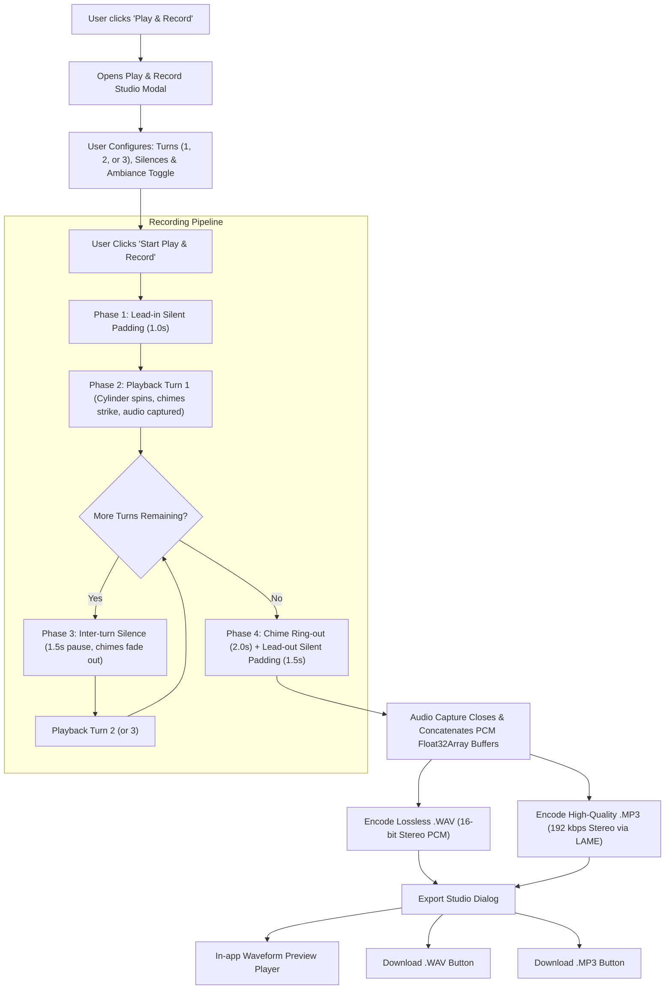

# Implementation Plan: Play & Record Feature (.WAV & .MP3 Export)

## Goal Description
Implement an authentic **Play & Record** feature for the Mechanical Music Box application. Users can record the music box performance across **1, 2, or 3 repeated turns**, with a configurable **short silence between turns**, as well as **silent paddings before and after the entire recording**. The resulting audio can be previewed in an in-app player and downloaded as studio-quality lossless **.WAV** (16-bit PCM stereo) and **.MP3** (192 kbps stereo).

---

## User Review Required

> [!IMPORTANT]
> **Key Design Decisions for User Review**:
> 1. **Recording Mode**: Live Play & Record plays the music box in real time (the cylinder spins, tines vibrate, and audio plays through speakers) while capturing the raw PCM audio stream directly from Web Audio. When turns complete, the user can immediately preview and download both .WAV and .MP3 files.
> 2. **Default Timing Parameters**:
>    - **Turns**: 2 Turns (selectable: 1, 2, or 3 turns).
>    - **Silence Between Turns**: 1.5 seconds (adjustable 0.5s – 3.0s).
>    - **Lead-In Silent Padding (Before)**: 1.0 second (adjustable 0.5s – 3.0s).
>    - **Lead-Out Silent Padding (After)**: 1.5 seconds after natural chime ring-out (adjustable 1.0s – 4.0s).
> 3. **Audio Content Choice**: By default, recording captures pure music box chimes with the active acoustic chamber resonance. A toggle ("Include Nature Ambiance & Mechanical Hum") allows users to optionally include the fireplace, rain, forest, and vintage gear hum in their recording.
> 4. **Dependency**: We will add `@breezystack/lamejs` (modern ESM/TS build of LAME MP3 encoder) via Bun for fast, client-side MP3 encoding without server roundtrips or third-party cloud uploads. WAV encoding is implemented natively in pure TypeScript.

---

## Architecture & Data Flow



---

## Proposed Changes

### Component 1: Audio Recording & Encoding Engine

#### [NEW] `src/audio/audioRecorder.ts`
- Dedicated audio recording tap connecting to Web Audio API.
- Implements `AudioRecorder` class using stereo PCM capture buffers (`Float32Array`).
- **`encodeWav(buffer)`**: Pure TypeScript RIFF 16-bit PCM WAV encoder generating a downloadable `Blob` (`audio/wav`).
- **`encodeMp3(buffer, bitrateKbps)`**: Uses `@breezystack/lamejs` to encode interleaved Int16 PCM samples to MPEG-1 Layer 3 MP3 `Blob` (`audio/mp3`).
- Provides utility functions: sample clamping to prevent distortion, peak level calculation, duration formatting, and object URL cleanup.

```typescript
export interface RecordedAudioSession {
  wavBlob: Blob;
  mp3Blob: Blob;
  wavUrl: string;
  mp3Url: string;
  durationSeconds: number;
  sampleRate: number;
  channels: number;
  songTitle: string;
  turns: number;
  chamberPreset: string;
}
```

---

### Component 2: Audio Engine Tap (`musicBoxAudio.ts`)

#### [MODIFY] `src/audio/musicBoxAudio.ts`
- Add a dedicated audio routing tap for recording:
  - Add `recordingTapGain: GainNode` connected to `dryGain` + `wetGain` (for pure chime recording).
  - Connect `recordingTapGain` to `masterGain` if ambiance is enabled.
  - Expose `getAudioContext(): AudioContext | null` and `getRecordingNode(includeAmbiance: boolean): GainNode | null`.
- Ensure clean chime ring-out tracking so decay trails are captured with zero truncation.

---

### Component 3: Play & Record Sequencer Logic (`App.tsx`)

#### [MODIFY] `src/App.tsx`
- Add recording state machine:
  - `recordingState`: `'idle' | 'lead-in' | 'recording-turn' | 'inter-turn-silence' | 'lead-out' | 'complete'`
  - `recordingTurnsConfig`: `1 | 2 | 3` (default `2`)
  - `recordingCurrentTurn`: `1 | 2 | 3`
  - `interTurnSilenceDuration`: default `1.5` seconds
  - `leadInPaddingDuration`: default `1.0` second
  - `leadOutPaddingDuration`: default `1.5` seconds
- In playback loop:
  - Detect turn boundary when `currentStep` reaches `totalSteps - 1`.
  - On turn completion:
    - If `currentTurn < targetTurns`: pause cylinder movement and sound triggers for `interTurnSilenceDuration`, then resume step 0 for next turn.
    - If `currentTurn >= targetTurns`: transition to `lead-out` (chime ringout + silent padding), finalize recording, and present the Export Studio.
  - Support "Stop Early & Export Now" (gracefully finalize whatever turns/steps were completed).
  - Support "Cancel Recording" (discard and reset).

---

### Component 4: Play & Record UI & Modals

#### [NEW] `src/components/PlayRecordModal.tsx`
- Sleek, vintage brass-styled modal with 3 states:
  1. **Configuration View**:
     - Turn selector: `[ 1 Turn ]` | `[ 2 Turns ]` | `[ 3 Turns ]` with dynamic estimated time calculation (e.g. `~28s`, `~58s`, `~1m 27s`).
     - Timing sliders / inputs for:
       - Silence between turns (0.5s – 3.0s, default 1.5s)
       - Lead-in silent padding (0.5s – 3.0s, default 1.0s)
       - Lead-out silent padding (1.0s – 4.0s, default 1.5s)
     - Ambiance toggle: "Include Nature Ambiance & Mechanical Hum" (checkbox, default unchecked for clean studio chime master).
     - Big prominent "Start Play & Record" button.
  2. **Live Recording HUD / Overlay**:
     - Red pulsing recording beacon (`● REC`).
     - Live turn status badge (e.g., `Recording Turn 1 of 2` or `Inter-turn Silence...`).
     - Real-time elapsed time vs. estimated total (`00:24 / 00:58`).
     - Audio level VU meter.
     - Controls: "Stop & Export Now" and "Cancel".
  3. **Export Studio View**:
     - Recording completed banner with track details.
     - Built-in audio player with waveform scrubber and play/pause button to audition the recording before downloading.
     - **"Download .WAV"** button (Lossless 16-bit PCM stereo master).
     - **"Download .MP3"** button (192 kbps high-quality MP3).
     - "Record Again" button.

#### [MODIFY] `src/App.tsx` & `src/components/WindingKey.tsx`
- Add "Play & Record" button (with red record dot icon and tooltip) on the main song banner next to the Play and Rewind buttons.
- Add quick Record trigger in the `WindingKey` bottom controls bar.

#### [MODIFY] `src/components/ImportExportModal.tsx`
- Add an "Audio Recording (.wav / .mp3)" banner/card in the Export tab that opens the Play & Record modal directly from the library export dialog.

---

### Component 5: Package Configuration

#### [MODIFY] `package.json`
- Add `@breezystack/lamejs` dependency:
  ```json
  "dependencies": {
    "@breezystack/lamejs": "^1.2.7"
  }
  ```

---

## Verification Plan

### Automated Tests / Builds
- Run `bun run lint` (`tsc --noEmit`) to ensure complete TypeScript type safety.
- Run `bun run build` (`vite build`) to verify clean bundle generation without module resolution issues.

### Manual Verification
1. **Turn Settings Verification**:
   - Test recording with **1 Turn**: Confirm lead-in padding -> 1 full song rotation -> lead-out padding -> finishes.
   - Test recording with **2 Turns**: Confirm lead-in padding -> Turn 1 -> 1.5s silence -> Turn 2 -> lead-out padding -> finishes.
   - Test recording with **3 Turns**: Confirm lead-in padding -> Turn 1 -> silence -> Turn 2 -> silence -> Turn 3 -> lead-out padding -> finishes.
2. **Silence & Padding Verification**:
   - Inspect recorded audio waveform: confirm silence before the first note strikes.
   - Confirm clear silence between turn repetitions where notes ring down into silence.
   - Confirm clean silent padding at the end of the recording without abrupt audio clipping.
3. **Audio Export Verification**:
   - Download both `.wav` and `.mp3` files.
   - Play `.wav` in browser / VLC / OS media player to confirm 16-bit uncompressed audio quality.
   - Play `.mp3` in browser / OS media player to confirm clean 192kbps MP3 encoding.
   - Test "Stop Early & Export Now" during Turn 2 to confirm partial recording exports successfully.
